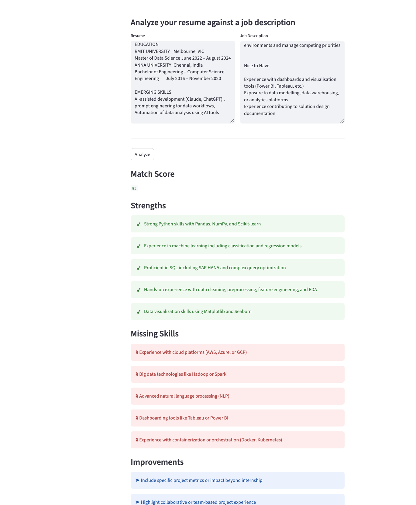

# AI Resume Job Matcher

## Overview

AI Resume Job Matcher is a Python-based application that analyzes a candidate’s resume against a specific job description.
It provides structured insights to help job seekers understand their alignment with a role and identify areas for improvement.

---

## Problem Statement

Job applicants often receive little to no feedback on why their applications are unsuccessful.
This project addresses that gap by offering a clear comparison between a resume and a job description, highlighting mismatches and actionable improvements.

---

## Demo



## Features

* Resume analysis based on industry expectations
* Job description comparison
* Match score estimation
* Identification of missing or weak skill areas
* Targeted suggestions to improve alignment
* User-friendly display of results optimised JSON output
* Interactive UI using Streamlit

---

## Tech Stack

* Python
* OpenAI API
* File-based input handling (`.txt`)

---

## Project Structure

```
ai-resume-job-matcher/
├── app.py
├── resume.txt
├── job_description.txt
├── requirements.txt
└── README.md
```

---

## How It Works

1. The application reads resume content from a text file
2. It reads a job description provided by the user
3. Both inputs are sent to an AI model for analysis
4. The system returns:

   * Match score
   * Key strengths
   * Missing skills
   * Suggested improvements

---

## Setup & Run

1. Clone the repository

2. Install dependencies:

```bash
pip install -r requirements.txt
```

3. Set your OpenAI API key as an environment variable:

```bash
export OPENAI_API_KEY="your_api_key_here"
```

4. Add your input files:

* `resume.txt`
* `job_description.txt`

5. Run the CLI version:

```bash
python app.py
```

6. Run the UI (recommended):

```bash
streamlit run streamlit_app.py
```

---

## Current Status

This project is under active development.
Upcoming improvements include structured scoring logic, enhanced prompt design, and a user interface.

---

## Future Enhancements

* Streamlit-based UI
* Support for PDF/DOCX resumes
* Improved ATS-style scoring system
* Deployment as a web application

---

## Sample Output

{
  "match_score": 75,
  "strengths": [
    "Strong Python and data analysis skills"
  ],
  "missing_skills": [
    "Agile methodologies"
  ],
  "improvements": [
    "Add dashboarding experience (Power BI/Tableau)"
  ]
}

---

## Author

Sushil Sundar
